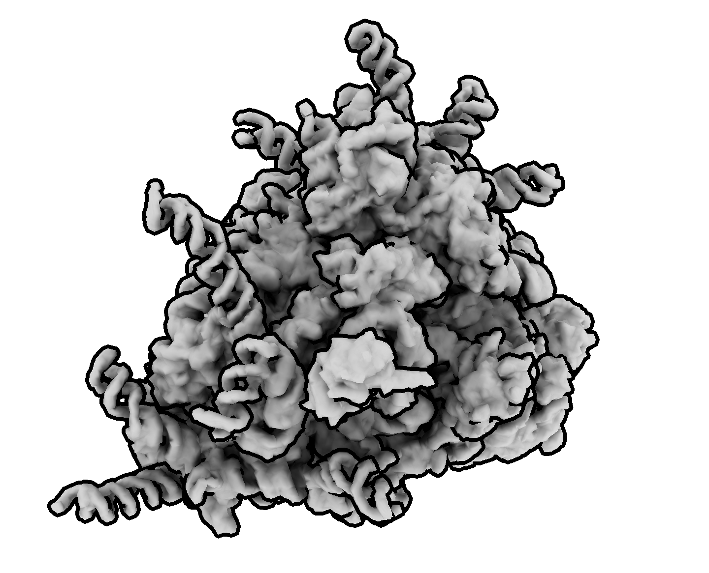
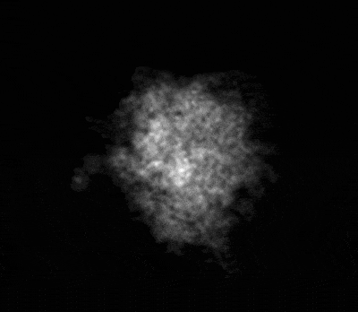

# mojo hackathon project - cryo-EM projection GPU kernel

This repo contains a GPU accelerated kernel for projecting a cubic 3D volume into a 2D image written in
[Mojo](https://docs.modular.com/mojo/manual/get-started/).
<div align="center">
  <table>
    <tr>
      <td></td>
      <td><span style="font-size: 2em; margin: 0 20px;">→</span></td>
      <td></td>
    </tr>
  </table>
</div>

This projection operation is implemented in Fourier space, where projecting 3D density to 2D involves sampling a central
slice from a 3D Fourier transform.

- https://en.wikipedia.org/wiki/Projection-slice_theorem
- https://github.com/teamtomo/torch-fourier-slice

## Performance

The 3D volume used for benchmarking is a simulated ribosome density from [PBD 4v6x](https://www.rcsb.org/structure/4V6X)
at 4Å/px.
The volume is available on [zenodo: 11722330](https://doi.org/10.5281/zenodo.11722330)

```sh
$ pixi run build
$ pixi run benchmark-torch
>> projections per second torch (cuda): 13468.79
$ pixi run benchmark-mojo
>> projections per second mojo gpu:  482362.16
```

This project was completed by
[Jeff Martin](https://bsky.app/profile/jeff.cuchazinteractive.org) and
[Alister Burt](https://bsky.app/profile/alisterburt.bsky.social) as part of the
[Modular Hack Weekend](https://forum.modular.com/t/schedule-for-modular-hack-weekend/1764) in June 2025.


